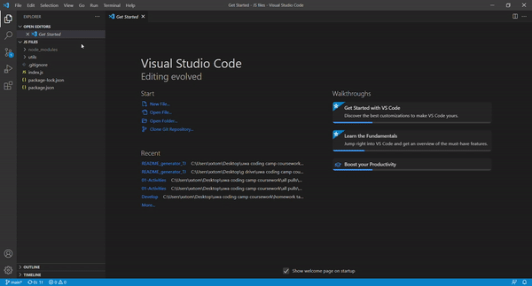

# Professional README generator

## Description

A Node project, which assists in the act of creating a README file. This is done by prompting questions for the user to fill in, and using the results to fill in the README headings

## Table of Contents

- [Description](#description)
- [Installation](#installation)
- [Usage](#usage)
- [Licence](#licence)
- [Contribution](#contribution)
- [Tests](#tests)
- [Questions](#questions)

## Installation

download the project from github, open the terminal and run NPM install to get the dependancies

## Usage

in the terminal, type Node index.js, and answer the prompted questions

## Licence

This is free and unencumbered software released into the public domain.

    Anyone is free to copy, modify, publish, use, compile, sell, or
    distribute this software, either in source code form or as a compiled
    binary, for any purpose, commercial or non-commercial, and by any
    means.

    In jurisdictions that recognize copyright laws, the author or authors
    of this software dedicate any and all copyright interest in the
    software to the public domain. We make this dedication for the benefit
    of the public at large and to the detriment of our heirs and
    successors. We intend this dedication to be an overt act of
    relinquishment in perpetuity of all present and future rights to this
    software under copyright law.

    THE SOFTWARE IS PROVIDED "AS IS", WITHOUT WARRANTY OF ANY KIND,
    EXPRESS OR IMPLIED, INCLUDING BUT NOT LIMITED TO THE WARRANTIES OF
    MERCHANTABILITY, FITNESS FOR A PARTICULAR PURPOSE AND NONINFRINGEMENT.
    IN NO EVENT SHALL THE AUTHORS BE LIABLE FOR ANY CLAIM, DAMAGES OR
    OTHER LIABILITY, WHETHER IN AN ACTION OF CONTRACT, TORT OR OTHERWISE,
    ARISING FROM, OUT OF OR IN CONNECTION WITH THE SOFTWARE OR THE USE OR
    OTHER DEALINGS IN THE SOFTWARE.

    For more information, please refer to <http://unlicense.org/>

## Contribution

Contact me for contribution guidelines, as they will be worked out on a case by case basis

## Tests

N/A

## Questions

Visit my Github at
https://github.com/tomjia98

For any more questions, feel free to contact me at tomchristian1998@gmail.com
